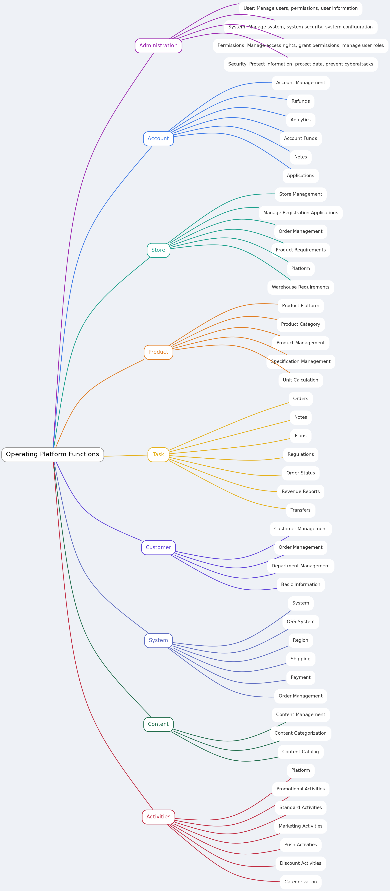
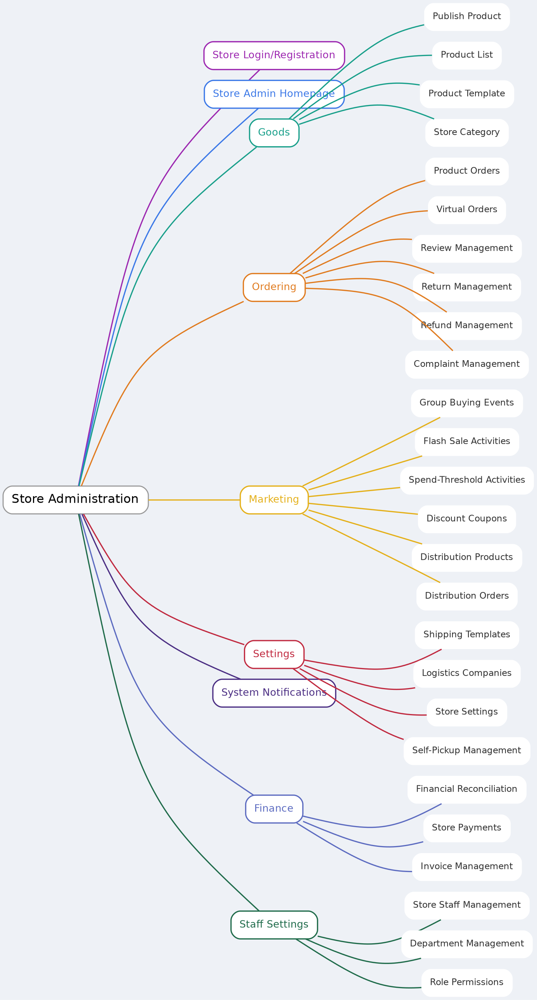
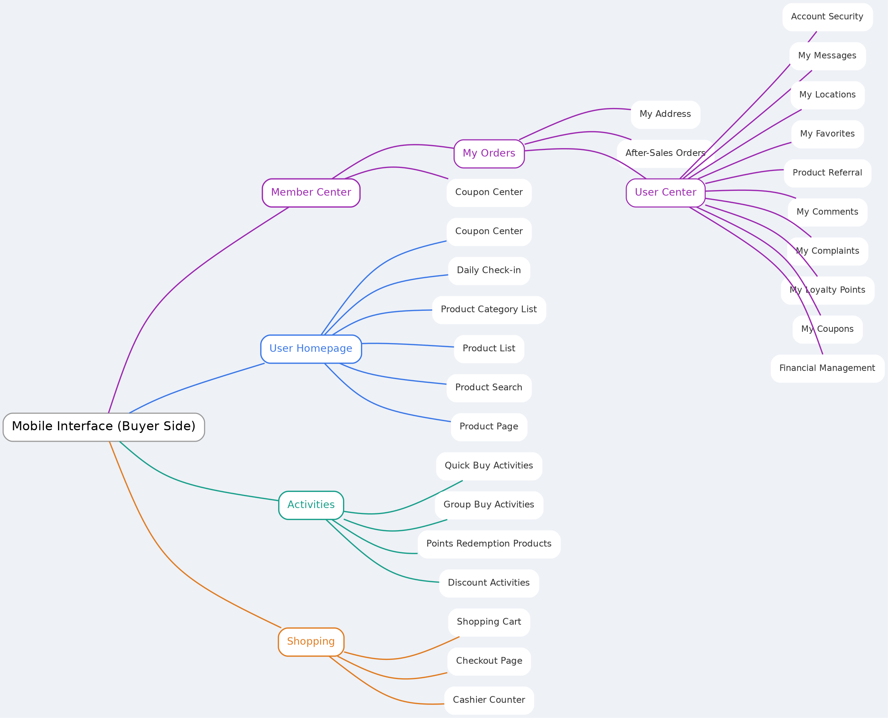
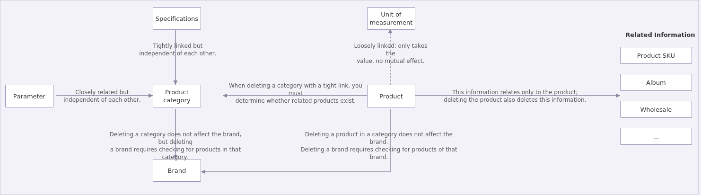

# MyShop – Java E-commerce Backend

## Overview

MyShop is a backend system for an e-commerce platform (Shopee-style, lite version), built to handle core e-commerce functionality such as product management, orders, payments, and inventory.

The project is developed in Java with a modular, layered architecture and follows Spring Boot best practices.

## Mind Maps

### Project Architecture

1. Operating platform



2. Shop Management


3. User Management


4. Product Data Relationships


## Features

- **User Management**
  - User Registration and Authentication
  - Password Management
  - Profile Management
  - Two-factor authentication (2FA)

- **Product Management**
  - Add, Update, Delete Products
  - Categories and Tags
  - Search and Filter Products
  - Reviews and Ratings

- **Order Management**
  - Create, Update, Cancel Orders
  - Order Tracking
  - Payment Integration (Stripe, PayPal, etc.)
  - Order Status Notifications

- **Cart and Wishlist**
  - Add to Cart
  - Manage Wishlist

- **Inventory Management**
  - Stock Levels per Product
  - Backorders and Inventory Tracking

- **Shipping and Delivery**
  - Integration with shipping services (FedEx, DHL, etc.)
  - Real-time Shipping Rates and Estimated Delivery Time
  - Order Dispatch and Delivery Tracking

- **Payments**
  - Support Multiple Payment Methods
  - Payment Gateway Integration (Stripe, PayPal, etc.)
  - Refunds and Returns

- **Admin Dashboard**
  - Manage Users, Products, Orders, and Reviews
  - Analytics for Sales, Revenue, and User Behavior

- **Notifications**
  - Email and SMS Notifications for Orders and Shipping
  - Push Notifications

## Technologies

- **Java 17**
- **Spring Boot** (for RESTful APIs)
- **Hibernate / JPA** (for ORM and database interaction)
- **MySQL / PostgreSQL** (for data storage)
- **Redis** (for caching and session management)
- **Kafka / RabbitMQ** (for messaging and event-driven architecture)
- **ElasticSearch** (for search and filtering products)
- **Swagger** (for API documentation)
- **Docker** (for containerization)
- **JUnit** and **Mockito** (for testing)
- **OAuth 2.0** and **JWT** (for authentication and security)

## Project Structure (DDD, Multi-module)

```
.
├── README.md
├── mvnw
├── mvnw.cmd
├── myshop-framework
│   └── pom.xml
├── myshop-module-buyer
│   ├── pom.xml
│   └── src
│       └── main
│           └── java
│               └── com
│                   └── myshop
│                       └── BuyerApplicationApi.java
├── myshop-module-manager
│   ├── pom.xml
│   └── src
│       └── main
│           └── java
│               └── com
│                   └── myshop
│                       └── ManagerApplicationApi.java
├── myshop-module-store
│   ├── pom.xml
│   └── src
│       └── main
│           └── java
│               └── com
│                   └── myshop
│                       └── StoreApplicationApi.java
└── pom.xml
```

Each module is an independent Spring Boot application:

- **myshop-framework** – shared entities, services, security, caching, and ORM configuration used across modules.
- **myshop-module-buyer** – customer/buyer-facing APIs.
- **myshop-module-manager** – admin/back-office management APIs.
- **myshop-module-store** – store/seller-facing APIs.

## Task Checklist

### User Management
- [ ] User Registration (Sign-up)
- [ ] User Authentication (Login/Logout)
- [ ] Implement JWT Token for Authentication
- [ ] Password Reset and Update
- [ ] Two-factor Authentication (2FA)
- [ ] Profile Management (Edit Profile, Upload Avatar)

### Product Management
- [ ] Create Product
- [ ] Update Product Details
- [ ] Delete Product
- [ ] Implement Search and Filter by Category
- [ ] Add Product Reviews and Ratings

### Order Management
- [ ] Create New Order
- [ ] Update Order Status (Processing, Shipped, Delivered, etc.)
- [ ] Cancel Order
- [ ] Integrate with Payment Gateway (Stripe/PayPal)
- [ ] Track Order Status and Delivery

### Cart and Wishlist
- [ ] Add to Cart
- [ ] View Cart and Checkout
- [ ] Add to Wishlist
- [ ] Remove from Cart/Wishlist

### Inventory Management
- [ ] Track Stock Levels for Products
- [ ] Handle Out-of-Stock Situations
- [ ] Implement Inventory Notification (Low Stock)

### Shipping and Delivery
- [ ] Integrate with Shipping APIs (FedEx/DHL)
- [ ] Provide Real-time Shipping Rates
- [ ] Implement Order Dispatch and Delivery Tracking

### Payments
- [ ] Integrate Stripe Payment
- [ ] Integrate PayPal Payment
- [ ] Handle Refunds and Returns
- [ ] Support Multiple Payment Methods

### Notifications
- [ ] Email Notifications for Order Confirmation
- [ ] SMS Notifications for Shipping Updates
- [ ] Push Notifications

### Admin Dashboard
- [ ] Manage Users
- [ ] Manage Products
- [ ] Manage Orders
- [ ] View Analytics (Sales, Revenue)

### Testing
- [ ] Write Unit Tests (JUnit, Mockito)
- [ ] Write Integration Tests

## Getting Started

1. **Clone the Repository**:
   ```bash
   git clone https://github.com/codecraftxabhi/JAVA-ecommerce-backend-api-MEMBER.git
   cd JAVA-ecommerce-backend-api-MEMBER
   ```

2. **Build the Project**:
   ```bash
   mvn clean install
   ```

3. **Run with Docker**:
   ```bash
   docker-compose up
   ```

4. **Access the API Documentation**:
   Once the server is running, go to: `http://localhost:9966/swagger-ui/`

## License

This project is licensed under the MIT License - see the [LICENSE](LICENSE) file for details.

## Author

**Abhishek Verma**
[GitHub](https://github.com/codecraftxabhi)
